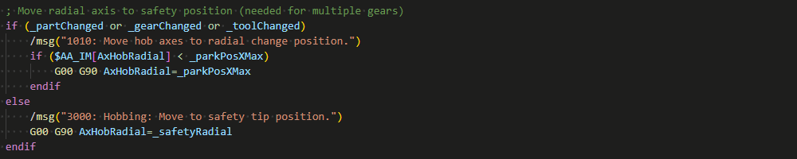
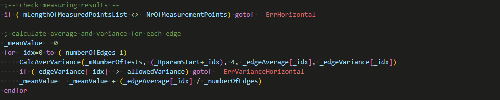
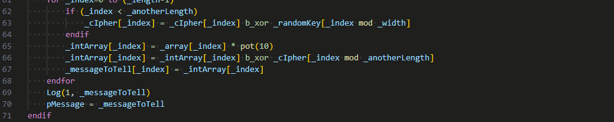

# Lance
**L**anguage **a**ppliance for **n**umerical **c**ontrol cod**e** of the Sinumerik One CNC control from Siemens.

## Description
Lance is an extension that provides common language features for the g-code based NC language from Siemens. The grammar for these features is an own interpretation of the manuals available from Siemens for the control system SINUMERIK ONE of the CNC software version 6.20 released in July 2022. The manuals used for the grammar are primarily the "Basic functions" and "NC programming" manuals and secondarily the "Axes and spindles", "Monitoring and compensating", " Synchronized actions", "Technologies", "Tool management", "Tools" and "Transformations" manuals.

This extension is in no way associated with Siemens, nor does Siemens endorse it.

## Features
Semantic syntax highlighting with theme support.

Hover over symbols to see the definition of them. This works for procedures, macros, variables, parameters, labels and block numbers.

Depending on your hotkey configuration you can ctrl + click on a symbol to jump to its definition. This works for procedures, macros, variables, parameters, labels and block numbers.

## Getting started
Make sure you have a .NET runtime with version 6.0 or newer. if not, you can get it from the official [microsoft download page](https://dotnet.microsoft.com/en-us/download/dotnet/6.0).

## Extension Settings
To change the colors of the syntax highlighting you can [change the theme](https://code.visualstudio.com/docs/getstarted/themes) or [configure some color customizations](https://code.visualstudio.com/docs/getstarted/themes#_customizing-a-color-theme).

There are settings to set the file extensions of the different file types of the language. Per default .def, .mpf and .spf files are configured. These files are loaded on startup to provide the respective insights. 

There are also some settings for a customizable preprocessor. It can be used to replace project specific placeholders before the file is parsed.

## Known Issues

If you have any problems, see if there is a related issue or write me one on [github](https://github.com/Nuaduwodan/lance/issues).
