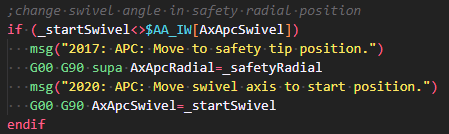

# lance
Language Appliance for Numerical Control codE of the sinumerik one cnc control system by siemens

## Description
Lance is an Extension which provides common language features for the g-code based NC language from Siemens. The grammar for these features is an own interpretation of the available manuals from Siemens for the control system SINUMERIK ONE of the CNC software version 6.20 released in july 2022. Primarily the manuals "Basic functions" and "NC programming" and secondarily the manuals "Axes and spindles
", "Monitoring and compensating", "Synchronized actions", "Technologies", "Tool management", "Tools" and "Transformations" are used for the grammar.

## Features

Syntax highlighting without semantic highlighting.

## Extension Settings

There aren't currently any settings having a meaningful impact. But you can change the colorscheme the highlighting is using by changing your theme and or by configuring some color customizations. see https://code.visualstudio.com/docs/getstarted/themes#_customizing-a-color-theme.

## Known Issues

-

## Release Notes
### 0.0.1

Initial release with syntax highlighting without semantic highlighting.
